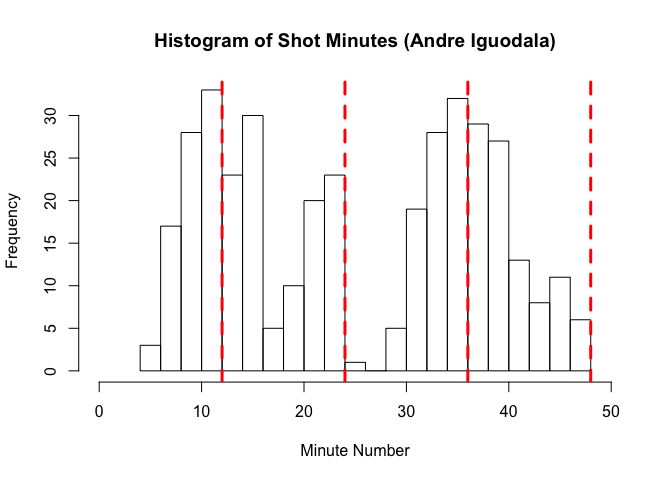
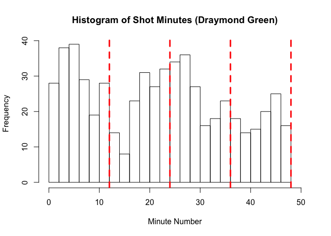
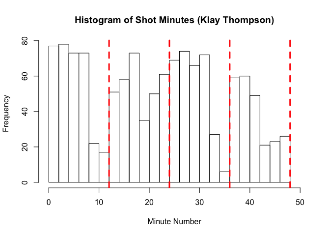
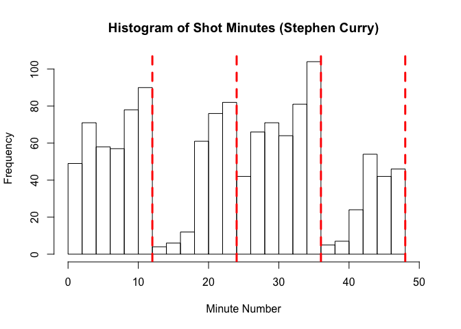
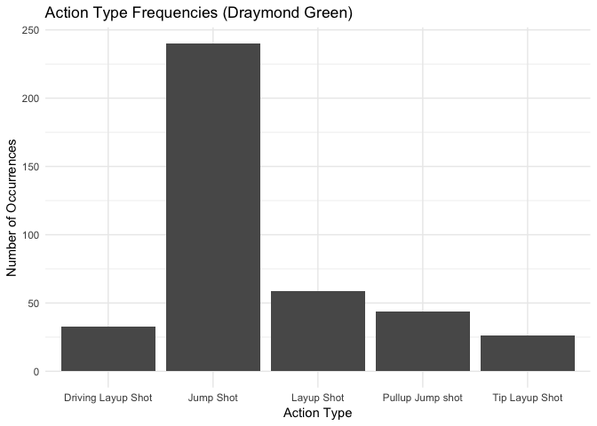
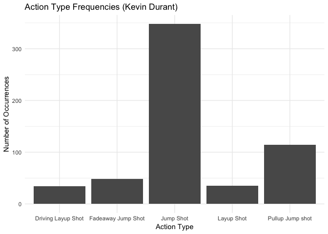

Workout 01: GSW Shot Charts
================
Lily Bhattacharjee
3/12/2019

Introduction
------------

The Golden State Warriors, a professional basketball team based in California, has made history multiple times, setting many NBA records including the best regular season and largest number of season wins. The team has won six NBA championships to tie for third place in NBA history, and is one of the highest-valued sports teams in the world. In this report, we delve deeper into the data behind the rankings, focusing on the 2016 season shot records of five of the current members (encompassing the forward and guard positions) -- Andre Iguodala, Draymond Green, Kevin Durant, Klay Thompson, and Stephen Curry. By noting the objectively most successful players with regards to attempted shot locations, shot type, time of shot, and action leading into the shot, we can distinguish player strengths and how responsibilities or strategy objectives are distributed amongst the team, leading to a higher chance at winning matches.

A Comparative Analysis of Shot Locations
----------------------------------------

Strengths by Shot Type
----------------------

| name           |  total|  made|  perc\_made|
|:---------------|------:|-----:|-----------:|
| Kevin Durant   |    915|   495|   0.5409836|
| Andre Iguodala |    371|   192|   0.5175202|
| Klay Thompson  |   1220|   575|   0.4713115|
| Stephen Curry  |   1250|   584|   0.4672000|
| Draymond Green |    578|   245|   0.4238754|

| name           |  total\_2|  made\_2|  perc\_made\_2|
|:---------------|---------:|--------:|--------------:|
| Andre Iguodala |       210|      134|      0.6380952|
| Kevin Durant   |       643|      390|      0.6065319|
| Stephen Curry  |       563|      304|      0.5399645|
| Klay Thompson  |       640|      329|      0.5140625|
| Draymond Green |       346|      171|      0.4942197|

| name           |  total\_3|  made\_3|  perc\_made\_3|
|:---------------|---------:|--------:|--------------:|
| Klay Thompson  |       580|      246|      0.4241379|
| Stephen Curry  |       687|      280|      0.4075691|
| Kevin Durant   |       272|      105|      0.3860294|
| Andre Iguodala |       161|       58|      0.3602484|
| Draymond Green |       232|       74|      0.3189655|

Strengths by Game Period
------------------------

Favored Actions Preceding Shots
-------------------------------

Conclusion
----------
