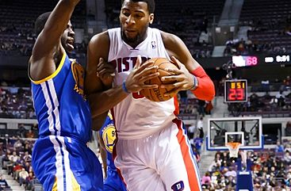
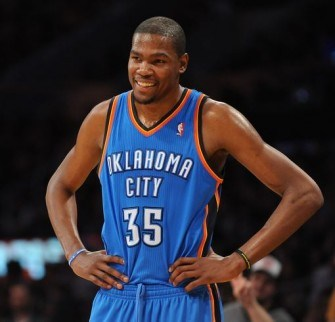
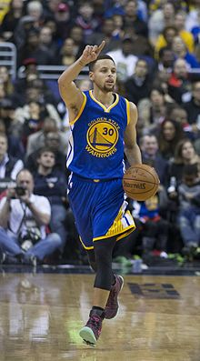
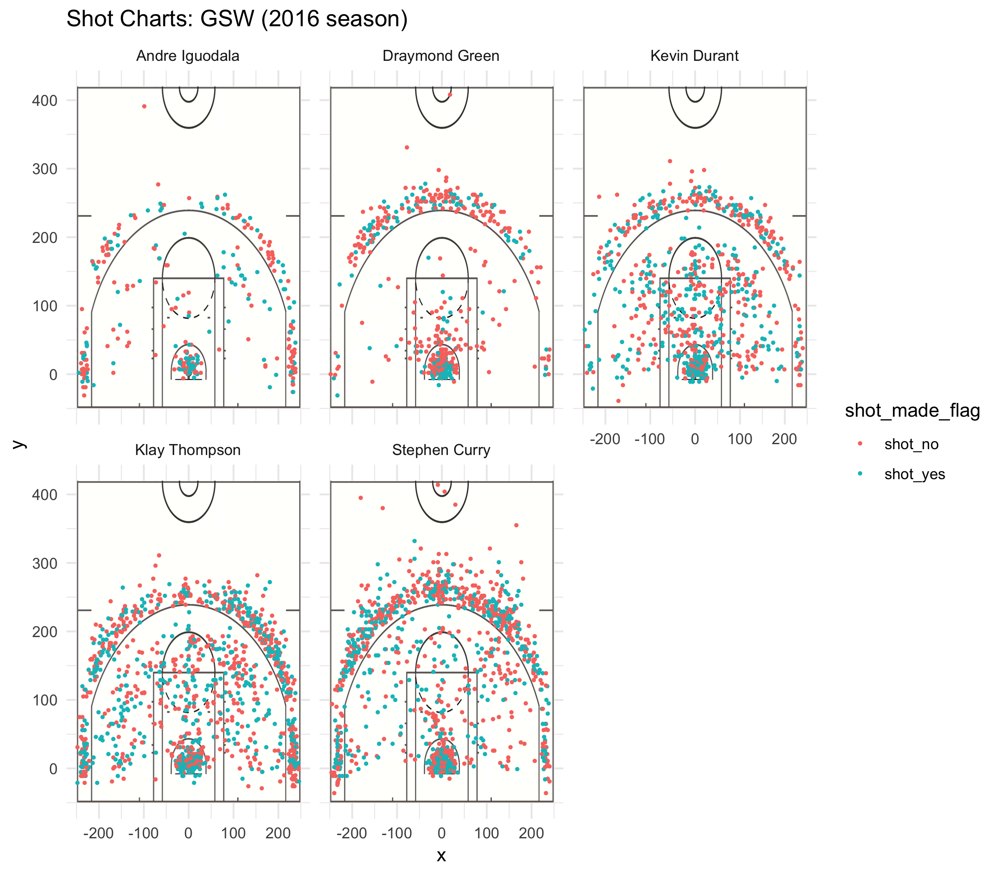

```{r setup, include=FALSE}
library('knitr')
library('dplyr')
library('plyr')
library('ggplot2')
knitr::opts_chunk$set(echo = TRUE)
```

```{r echo = FALSE}
# import data from shots_data
column_classes = c("character", "character", "character", "integer", "integer", "integer", "integer", "character", "character",
                   "character", "integer", "character", "integer", "integer", "character", "integer")
shots_data <- read.csv("../data/shots-data.csv", stringsAsFactors = FALSE, colClasses = column_classes)
andre <- filter(shots_data, name == "Andre Iguodala")
draymond <- filter(shots_data, name == "Draymond Green")
kevin <- filter(shots_data, name == "Kevin Durant")
klay <- filter(shots_data, name == "Klay Thompson")
stephen <- filter(shots_data, name == "Stephen Curry")

name <- c("Andre Iguodala", "Draymond Green", "Kevin Durant", "Klay Thompson", "Stephen Curry")
total <- c(nrow(andre), nrow(draymond), nrow(kevin), nrow(klay), nrow(stephen))
made <- c(nrow(filter(andre, shot_made_flag == "shot_yes")), nrow(filter(draymond, shot_made_flag == "shot_yes")), nrow(filter(kevin, shot_made_flag == "shot_yes")), nrow(filter(klay, shot_made_flag == "shot_yes")), nrow(filter(stephen, shot_made_flag == "shot_yes")))
perc_made <- made / total

total_2 <- c(nrow(filter(andre, shot_type == "2PT Field Goal")), 
             nrow(filter(draymond, shot_type == "2PT Field Goal")), 
             nrow(filter(kevin, shot_type == "2PT Field Goal")), 
             nrow(filter(klay, shot_type == "2PT Field Goal")), 
             nrow(filter(stephen, shot_type == "2PT Field Goal")))
made_2 <- c(nrow((filter(filter(andre, shot_type == "2PT Field Goal"), shot_made_flag == "shot_yes"))), 
            nrow((filter(filter(draymond, shot_type == "2PT Field Goal"), shot_made_flag == "shot_yes"))), 
            nrow((filter(filter(kevin, shot_type == "2PT Field Goal"), shot_made_flag == "shot_yes"))), 
            nrow((filter(filter(klay, shot_type == "2PT Field Goal"), shot_made_flag == "shot_yes"))), 
            nrow((filter(filter(stephen, shot_type == "2PT Field Goal"), shot_made_flag == "shot_yes"))))
perc_made_2 <- made_2 / total_2

total_3 <- c(nrow(filter(andre, shot_type == "3PT Field Goal")), 
             nrow(filter(draymond, shot_type == "3PT Field Goal")), 
             nrow(filter(kevin, shot_type == "3PT Field Goal")), 
             nrow(filter(klay, shot_type == "3PT Field Goal")), 
             nrow(filter(stephen, shot_type == "3PT Field Goal")))
made_3 <- c(nrow((filter(filter(andre, shot_type == "3PT Field Goal"), shot_made_flag == "shot_yes"))), 
            nrow((filter(filter(draymond, shot_type == "3PT Field Goal"), shot_made_flag == "shot_yes"))), 
            nrow((filter(filter(kevin, shot_type == "3PT Field Goal"), shot_made_flag == "shot_yes"))), 
            nrow((filter(filter(klay, shot_type == "3PT Field Goal"), shot_made_flag == "shot_yes"))), 
            nrow((filter(filter(stephen, shot_type == "3PT Field Goal"), shot_made_flag == "shot_yes"))))
perc_made_3 <- made_3 / total_3

effective_shooting_percentage = arrange(data.frame(name, total, made, perc_made), desc(perc_made))
effective_shooting_percentage_2 = arrange(data.frame(name, total_2, made_2, perc_made_2), desc(perc_made_2))
effective_shooting_percentage_3 = arrange(data.frame(name, total_3, made_3, perc_made_3), desc(perc_made_3))
```

## Introduction

The Golden State Warriors, a professional basketball team based in California, has made history multiple times, setting many NBA records including the best regular season and largest number of season wins. The team has won six NBA championships to tie for third place in NBA history, and is one of the highest-valued sports teams in the world. In this report, we delve deeper into the data behind the rankings, focusing on the 2016 season shot records of five of the current members (encompassing the forward -- F -- and guard -- G -- positions) -- Andre Iguodala (G / F), Draymond Green (F), Kevin Durant (F), Klay Thompson (G), and Stephen Curry (G). By noting the objectively most successful players with regards to attempted shot locations, shot type, time of shot, and action leading into the shot, we can distinguish player strengths and how responsibilities or strategy objectives are distributed amongst the team, leading to a higher chance at winning matches.

Players
-------------
  
 <br>


## A Comparative Analysis of Shot Locations

```{r echo = FALSE, fig.align = "center"}

```

The figure above is a set of five charts facetted by team member displaying the $x$ and $y$ locations on the court from which shot attempts occurred, with red representing failed and blue points representing successful shots. Comparing the scatter distributions, we notice that the majority of shot opportunities were taken by Klay Thompson and Stephen Curry, as they have the densest spread in all areas of the court, and this corroborates the public perception of the duo as the Splash Brothers, two of the best shooters of NBA history. Curry appears to be the most daring shooter of the group, having attempted at least 6 shots from the other end of the court, although the corresponding points as shown on the plot are all red indicating failure to make it through the hoop.

The blue concentrations at the heart of each diagram indicate that much of the time, players tend to get as close to the net as they can before shooting to maximize their success rate. This is a particularly clear trend for Iguodala and Green, who generally either attempt from the innermost circle near the hoop or the three-point line. On the other hand, Durant, Thompson, and Curry may be more accustomed to shooting from other angles and distances on the court, as although their attempts are also concentrated at the aforementioned locations, they have a significant amount of attempts in between as well from all orientations, with a mixed / almost even proportion of successes and failures.

These distributions imply a nearly-even balance between highly specialist and more general members on the GSW, which might be part of the secret to the team's almost unprecedented accomplishments on the court.

## Strengths by Shot Type

Now, we examine the types of shots that these forward and guard players take and potentially make. The table below is a summary of the total number of shots that each player has taken during all games in the 2016 season, the number of these shots that have earned the team points, and -- for reference -- a ranking by corresponding success rates. Overall, Durant is the most accurate shooter in the five players considered, with an accuracy of 54.1%, but it is important to note that this isn't an outlier; the success rates of all five players are relatively high, falling in the low 40-mid 50% range overall.

Also, although Thompson and Curry have attempted the most shots (> 1200) with Durant in a slightly distant third (~ 900), they have some of the lowest accuracies in the group. Is it possible that the team is overly reliant upon the duo or that they tend to operate better than the others when faced with the stress to score the final shot? We can look to the shot success split between 2- and 3-pointers to see how valid our hypotheses are.

```{r echo = FALSE, results = 'asis'}
knitr::kable(effective_shooting_percentage)
```

When examining the proportion of 2-pointers, we notice that Iguodala -- despite his low number of total shots -- is the best by a larger margin (~ 3% between him and 2nd place Durant). Curry and Thompson lag behind Durant by > 7% although they have attempted similar numbers of shots, perhaps indicating the usage of a strategy that can be optimized to capitalize more on Iguodala's and Durant's skills. However, because the success rates of the three other players hover around a still very good 50%, it might be simply better to try and possibly fail the shot rather than focus on orienting players at other positions and passing if the current setup is not optimal in the heat of an actual game.

```{r echo = FALSE, results = 'asis'}
knitr::kable(effective_shooting_percentage_2)
```

The success rates of 3-pointers are noticeably lower than those for the 2-pointers, likely largely due to distance from the hoop. An interesting note is that Thompson and Curry are the best of the 5 at this type of shot, living up to their reputation as backcourt shooters. The 2-pointer table ranking is flipped to an extent, with Iguodala and Durant being better close-court shooters and taking advantage of that to spend less of their attempted shots (~ $\frac{1}{3}$ of the total) attempting 3-pointers. We notice that Draymond Green is comparatively at the bottom of all of these charts in ranking, indicating that his strengths may lie in a different realm than taking the final shot.

```{r echo = FALSE, results = 'asis'}
knitr::kable(effective_shooting_percentage_3)
```

## Strengths by Game Period

The histograms below plot the distributions of minutes into the game where shots were attempted (graph 1) and when successful shots were made (graph 2) for each player, respectively. Additionally, each histogram includes dotted vertical lines marking the end of each game period (12-minute intervals until the 48-minute mark). This may be useful in helping determine the patterned highs and lows in game activity for each of the players, and how well some maintain their stamina until the last period.

```{r echo = FALSE, results = 'asis'}
nbreaks <- 20

hist(andre$minute, breaks = nbreaks, main = "Histogram of Shot Minutes (Andre Iguodala)", xlab = "Minute Number", xlim = c(0, 50))
abline(v = 12, col = "red", lwd = 3, lty = 2)
abline(v = 24, col = "red", lwd = 3, lty = 2)
abline(v = 36, col = "red", lwd = 3, lty = 2)
abline(v = 48, col = "red", lwd = 3, lty = 2)
```

```{r echo = FALSE, results = 'asis'}
hist(filter(andre, andre$shot_made_flag == "shot_yes")$minute, breaks = nbreaks, main = "Histogram of Successful Shot Minutes (Andre Iguodala)", xlab = "Minute Number", xlim = c(0, 50))
abline(v = 12, col = "red", lwd = 3, lty = 2)
abline(v = 24, col = "red", lwd = 3, lty = 2)
abline(v = 36, col = "red", lwd = 3, lty = 2)
abline(v = 48, col = "red", lwd = 3, lty = 2)
```

For Iguodala, the first ~5 minutes of every odd period seem dedicated to ramping up before attempting a shot while the even periods carry over the energy from the previous one. This appears to pay off to an extent, especially during periods 1 and 3, but there is a noticeable decline in the proportion of successful shots at the start of period 2. As the game continues, his number of successful shots also decreases as expected perhaps as exhaustion kicks in. Generally, Iguodala's time to shine is in the first period of the game although he is also quite reliable from the end of the 3rd period to the beginning of the 4th.

```{r echo = FALSE, results = 'asis'}
hist(draymond$minute, breaks = nbreaks, main = "Histogram of Shot Minutes (Draymond Green)", xlab = "Minute Number", xlim = c(0, 50))
abline(v = 12, col = "red", lwd = 3, lty = 2)
abline(v = 24, col = "red", lwd = 3, lty = 2)
abline(v = 36, col = "red", lwd = 3, lty = 2)
abline(v = 48, col = "red", lwd = 3, lty = 2)
```

```{r echo = FALSE, results = 'asis'}
hist(filter(draymond, draymond$shot_made_flag == "shot_yes")$minute, breaks = nbreaks, main = "Histogram of Successful Shot Minutes (Draymond Green)", xlab = "Minute Number", xlim = c(0, 50))
abline(v = 12, col = "red", lwd = 3, lty = 2)
abline(v = 24, col = "red", lwd = 3, lty = 2)
abline(v = 36, col = "red", lwd = 3, lty = 2)
abline(v = 48, col = "red", lwd = 3, lty = 2)
```

In contrast to Iguodala's tendency to front-load his abilities at the beginning of the game, Green's number of attempted shots is generally less volatile throughout the game periods, with peaks in the middle of the 1st period and between the 2nd and 3rd periods. From the histogram of successes, he appears to warm up in the 1st phase, cool down in the last, and reach peak performance in the middle. This complements Iguodala's strategy nicely but it is also integral to understand that the number of shots a player makes going down at a certain point (particularly the end of the game) doesn't mean that the player is not participating as much. While the goal of basketball is to score the most points at the basket, transferring the ball to the other end of the court and passing between teammates is an activity that isn't quantified in the dataset and should be taken into consideration when viewing analyses of this data.

```{r echo = FALSE, results = 'asis'}
hist(kevin$minute, breaks = nbreaks, main = "Histogram of Shot Minutes (Kevin Durant)", xlab = "Minute Number", xlim = c(0, 50))
abline(v = 12, col = "red", lwd = 3, lty = 2)
abline(v = 24, col = "red", lwd = 3, lty = 2)
abline(v = 36, col = "red", lwd = 3, lty = 2)
abline(v = 48, col = "red", lwd = 3, lty = 2)
```

```{r echo = FALSE, results = 'asis'}
hist(filter(kevin, kevin$shot_made_flag == "shot_yes")$minute, breaks = nbreaks, main = "Histogram of Successful Shot Minutes (Kevin Durant)", xlab = "Minute Number", xlim = c(0, 50))
abline(v = 12, col = "red", lwd = 3, lty = 2)
abline(v = 24, col = "red", lwd = 3, lty = 2)
abline(v = 36, col = "red", lwd = 3, lty = 2)
abline(v = 48, col = "red", lwd = 3, lty = 2)
```

Durant and Green are similarly consistent, peaking in the middle of the game in terms of both number of shot attempts and number of successful shots. Durant noticeably tones down the number of shots he makes near the end of the game and actually tends to become more accurate, making 40-60% of his shots. In the middle of the game, Durant is almost 80% accurate, and this is continually the period when he does his best work.

```{r echo = FALSE, results = 'asis'}
hist(klay$minute, breaks = nbreaks, main = "Histogram of Shot Minutes (Klay Thompson)", xlab = "Minute Number", xlim = c(0, 50))
abline(v = 12, col = "red", lwd = 3, lty = 2)
abline(v = 24, col = "red", lwd = 3, lty = 2)
abline(v = 36, col = "red", lwd = 3, lty = 2)
abline(v = 48, col = "red", lwd = 3, lty = 2)
```

```{r echo = FALSE, results = 'asis'}
hist(filter(klay, klay$shot_made_flag == "shot_yes")$minute, breaks = nbreaks, main = "Histogram of Successful Shot Minutes (Klay Thompson)", xlab = "Minute Number", xlim = c(0, 50))
abline(v = 12, col = "red", lwd = 3, lty = 2)
abline(v = 24, col = "red", lwd = 3, lty = 2)
abline(v = 36, col = "red", lwd = 3, lty = 2)
abline(v = 48, col = "red", lwd = 3, lty = 2)
```

Thompson's playing is considerably more volatile than those of the other players, and he seems to peak well during the first 3 periods in both the beginning and middle of each segment. His weaknesses / lowest number of shots made hover around the last few minutes of each period, complementing Curry's opposing method of doing best during that time. In that way, the two players cover each other's weaknesses, making it difficult to find a soft spot to exploit in the team.

```{r echo = FALSE, results = 'asis'}
hist(stephen$minute, breaks = nbreaks, main = "Histogram of Shot Minutes (Stephen Curry)", xlab = "Minute Number", xlim = c(0, 50))
abline(v = 12, col = "red", lwd = 3, lty = 2)
abline(v = 24, col = "red", lwd = 3, lty = 2)
abline(v = 36, col = "red", lwd = 3, lty = 2)
abline(v = 48, col = "red", lwd = 3, lty = 2)
```

```{r echo = FALSE, results = 'asis'}
hist(filter(stephen, stephen$shot_made_flag == "shot_yes")$minute, breaks = nbreaks, main = "Histogram of Successful Shot Minutes (Stephen Curry)", xlab = "Minute Number", xlim = c(0, 50))
abline(v = 12, col = "red", lwd = 3, lty = 2)
abline(v = 24, col = "red", lwd = 3, lty = 2)
abline(v = 36, col = "red", lwd = 3, lty = 2)
abline(v = 48, col = "red", lwd = 3, lty = 2)
```

Curry is unique from the rest of the players because he tends to do best in the 3rd period. He follows the general pattern of ramping up during the first ~6 minutes of each period and clutching good shots during the last 2-4 min. He makes the fewest number of shots during the last period, as most of the other players do.

## Favored Actions Preceding Shots

As evidenced from the bar plots below that depict the types of actions that the 5 players use to segue into their shot attempts, every player largely relies on the same signature move -- the jump shot. The bar plots only display the top 5 action types for each player, and in each case, the jump shot is by far the most frequently occurring action.

The second most frequent actions of choice for each of the players are the following: Iguodala's pullup jump shot, Green's layup shot, Durant's pullup jump shot, Thompson's pullup jump shot, and Thompson's pullup jump shot, indicating that in spite of their technical differences, the players perform their shots with a shared, conventional style.

```{r echo = FALSE, results = 'asis'}
andre_action <- count(andre, "action_type")
andre_action <- arrange(andre_action, desc(freq))[1:5, ]
ggplot(andre_action) + geom_bar(aes(x = action_type, weight = freq)) + theme_minimal() + xlab("Action Type") + ylab("Number of Occurrences") + ggtitle("Action Type Frequencies (Andre Iguodala)")
```

```{r echo = FALSE, results = 'asis'}
draymond_action <- count(draymond, "action_type")
draymond_action <- arrange(draymond_action, desc(freq))[1:5, ]
ggplot(draymond_action) + geom_bar(aes(x = action_type, weight = freq)) + theme_minimal() + xlab("Action Type") + ylab("Number of Occurrences") + ggtitle("Action Type Frequencies (Draymond Green)")
```

```{r echo = FALSE, results = 'asis'}
kevin_action <- count(kevin, "action_type")
kevin_action <- arrange(kevin_action, desc(freq))[1:5, ]
ggplot(kevin_action) + geom_bar(aes(x = action_type, weight = freq)) + theme_minimal() + xlab("Action Type") + ylab("Number of Occurrences") + ggtitle("Action Type Frequencies (Kevin Durant)")
```

```{r echo = FALSE, results = 'asis'}
klay_action <- count(klay, "action_type")
klay_action <- arrange(klay_action, desc(freq))[1:5, ]
ggplot(klay_action) + geom_bar(aes(x = action_type, weight = freq)) + theme_minimal() + xlab("Action Type") + ylab("Number of Occurrences") + ggtitle("Action Type Frequencies (Klay Thompson)")
```

```{r echo = FALSE, results = 'asis'}
stephen_action <- count(stephen, "action_type")
stephen_action <- arrange(stephen_action, desc(freq))[1:5, ]
ggplot(stephen_action) + geom_bar(aes(x = action_type, weight = freq)) + theme_minimal() + xlab("Action Type") + ylab("Number of Occurrences") + ggtitle("Action Type Frequencies (Stephen Curry)")
```

## Conclusion

In this report, by examining the shot locations, type, time, and action of five players on the Golden State Warriors basketball team, we uncovered some of ways in which the players approach the game and how their performance changes with regards to game period, position / orientation of the shot, and what kinds of segues they rely on when taking these shots. From the hard data evidence we noted a couple of interesting facts from the 2016 season:

- Iguodala's main strengths are his accurate 2-pointers and earning fast points in the beginning of the game
- While Green's accuracy rates are lower than the others, he remains more consistent in shoot attempts and successes throughout the game
- Curry and Thompson -- the dream backcourt duo -- do best at 3-pointers and are powerhouses, attempting the most shots in the game
- Durant is an all-around reliable player, good at both 2-pointers and 3-pointers and his ability to maintain his accuracy throughout the game is an important asset
- All of the players favor the jump shot when attempting a shot, although Green appears to have a different 2nd strongest action from the others -- the layup shot as opposed to the pullup the others favor

**The Point**: According to this dataset from 2016, Curry and Thompson live up to their hailed strengths in making faraway shots, and the rest of the players reveal skills that rival the aforementioned stars in importance, with each member's abilities complementing those of the others yet still containing enough overlap to form a cohesive whole.
